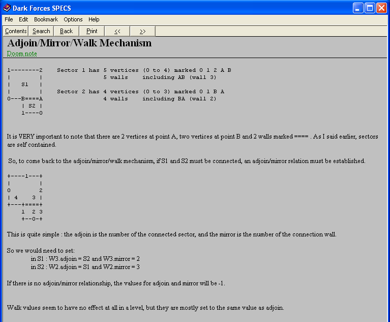

<!-- TOC -->

- [1. DF Specs](#1-df-specs)
- [2. Where to find Dark Forces / Outlaws related utilities](#2-where-to-find-dark-forces--outlaws-related-utilities)
- [3. In-Game editor](#3-in-game-editor)
- [4. Decompilation of HLP files](#4-decompilation-of-hlp-files)
- [5. Outlaws LAB file format](#5-outlaws-lab-file-format)
- [Testing Outlaws levels](#testing-outlaws-levels)
- [6. Outlaws specification notes](#6-outlaws-specification-notes)
  - [ATX files](#atx-files)
  - [INF files](#inf-files)
    - [How do items work](#how-do-items-work)
      - [Which objects are active, and can be influenced by INF files?](#which-objects-are-active-and-can-be-influenced-by-inf-files)
      - [How to update world state?](#how-to-update-world-state)
    - [Undocumented things from Outlaws INFs:](#undocumented-things-from-outlaws-infs)
    - [Undocumented things from Outlaws LVTs:](#undocumented-things-from-outlaws-lvts)

<!-- /TOC -->

# 1. DF Specs

CHM file: [DF Specs](./Df_specs_Converted/Df_specs.chm)  
Raw HTML files: [DF Specs](./Df_specs_Converted/html/df_s1qly.htm)  
Original HLP file: [DF Specs](./Df_specs.hlp)

Screenshot of ASCII art that was messed up in "Adjoin/Walk/Mirror Mechanism":


Other help files were not converted, as they are of limited use.

# 2. Where to find Dark Forces / Outlaws related utilities

[df-21.net utilities](https://df-21.net/downloads/util.php)

[The Outlaw Dad Files](http://www.theoutlawdad.com/Files.html)  
I suggest "Lawmaker Complete Install".

# 3. In-Game editor

[YouTube tutorial](https://www.youtube.com/watch?v=A6HsUk6_mlU)  
No idea where to find the necessary file `OLEDIT.DLL`...

# 4. Decompilation of HLP files

CHM file was generated from original HLP file as described in this tutorial:
http://www.help-info.de/en/Help_Info_WinHelp/hw_converting.htm#Decompiling


# 5. Outlaws LAB file format

Basic info is here:
[Reverse engineering LucasArts Outlaws](http://glampert.com/2015/10-10/reverse-engineering-lucasarts-outlaws/#the-lab-file-format)

# Testing Outlaws levels

Testing and generating log file.
```
OLWIN /df outlaws.log hideoutz.lvt
```

# 6. Outlaws specification notes

Various known flags for Outlaws can be seen in Lawmaker editor.

## ATX files

ATX are animated textures.  
ATX files contain simple instructions that define the texture's animation, sounds and pauses.  
They can be scripted with INF files. They can be influenced by shooting at them.  
They can be affected by game code also, I think (for example portraits of captured or killed bad guys in `Handfull of Missions` expansion.)

**Question:** What is the default rate of an ATX? Some ATX files don't start with RATE instruction (`SWITCH.ATX)`).

Available instructions:
- `RATE [num]` - sets animation playback rate (presumably in FPS).  
  This is only ever used as the first instruction, so maybe it cannot appear anywhere else. Some experimentation should be done here.
- `TEXTURE [texture name]` - sets texture to given.
- `START_SOUND [num] [sound name]` - starts given sound.  
  Purpose of `num` is unknown. In game it is only set to `64`.
- `STOP` - pauses the animation.  
  It seems that if animation is on a `STOP` then it starts again when:
  - The wall is triggered via an INF file.
  - The player shoots it.  
    Possibly wall with this texture needs `WALL_DAMAGES_PLAYER` flag (which should probably be named `PLAYER_DAMAGES_WALL`). This is just a guess. Some experimentation should be done here.
- `GOTO [instruction index]` - goes to instruction with given index.  
  Note: first instruction (always `RATE` in game) has index `0`.
- `GOTO STOP [num]` - unknown.  
  This instruction is used only in `BWLIBRY1.ATX` and `BALBRY4.ATX`. However those textures don't seem to be used in the game. It is not known if those instructions are a mistake (and `GOTO` was intended), or in fact such instructions exist and do something. Some experimentation should be done here.

Notes:
- I assume that only STOP and TEXTURE instructions consumes a clock cycle. All other instructions execute immediately. This needs investigation.
- I assume that initial rate of an ATX is 24. This is just a guess. This needs investigation.

## INF files

INF files contain scripting for the game.  
Each INF file contains a set of ITEMS.

ITEM can be one of four kinds:
- Level: `ITEM: LEVEL`  
  Not used in Outlaws nor Dark Forces (but mentioned in DF Specs).
- Sector: `ITEM: SECTOR NAME: [sector name]`  
  Describes behaviour for a sector. `sector name` is sector's name, not index.  
  Sector can be moved, rotated, it's floor and ceiling can be moved, etc.
- Wall: `ITEM: SECTOR NAME: [sector name] NUM: #[id]`  
  Describes behaviour for a wall. `id` is wall's identifier, not index.  
  Wall can have texture scrolled, can be adjoined to a sector, etc.
- Line: `ITEM: LINE NAME: [sector name] NUM: #[id]`  
  This is only used twice in the whole Outlaws game, to define a trigger.  
  I have no idea how it's different from Wall item. Some experimentation should be done here.

Example:
```
ITEM: SECTOR    NAME: DRTHORAXDOOR02
        SEQ
                CLASS: ELEVATOR MORPH_SPIN2
                CENTER: 15.125 464.000
                EVENT_MASK: 32
                SOUND: 1 DOOR4.WAV
                SPEED: 60
                STOP: 0 HOLD
                STOP: 85 HOLD
        SEQEND
```

Content of each item starts with `SEQ` and end with `SEQEND`.  
Between those two can be one or more `classes`. A class defines an `elevator` or a `trigger`.
- Elevator is basically a variable, with predefined `stops`, between which it can smoothly change values.  
  It's called `elevator` because this is what it's most often used for, but it can be used just as a variable. In that case a dummy sector is created somewhere outside of the map, and an elevator is attached to it.  
- Trigger is a set of messages to send or actions to perform that should be done when it is activated.

### How do items work

#### Which objects are active, and can be influenced by INF files?

- Sectors and Walls with ITEM attached.
- It seems that each sector with a NAME is implicitly an ITEM (it can be used as SLAVE to some explicit ITEM elevator).  
- Walls with ATX textures become implicitly items too, I think, because they can be triggered.
- `3DO` files can be influenced indirectly by `wakeup` messages sent to a sector. Not used in Outlaws.

#### How to update world state?

Each ATX should be updated each frame. It will use it's RATE and internal state to figure out which texture should be displayed. It should influence texture index in the wall this ATX is attached to.

Each elevator should be updated each frame. It can ifluence sector geometry, texturing, ATX files, lighting, player position (via floor scrolling, floor or sector movement)

Note: order of updates probably matters. Some experimentation is needed.

### Undocumented things from Outlaws INFs:
- `OBJECT: [num] [num] AUTO?`
- `MESSAGE: USER_MSG [num]` - num can be 800, 801, 802, 805 or 806.
- `OBJECT_EXCLUDE: [num] AUTO?`

### Undocumented things from Outlaws LVTs:

- `FLOOR OFFSETS` - Used only in `HIDEOUT.LVT`.
- `SHADES` - They seem to be identical in all levels.  
  They look like R G B, light level and some flag.
